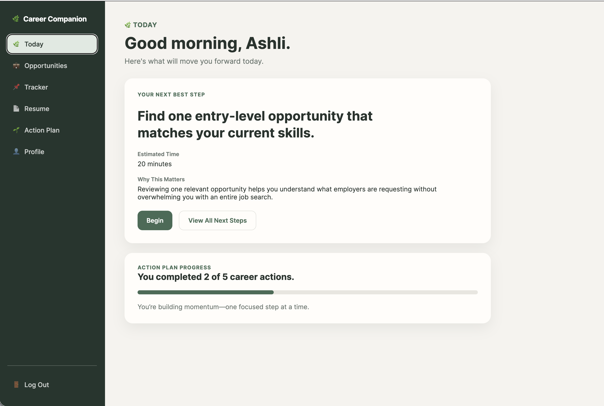
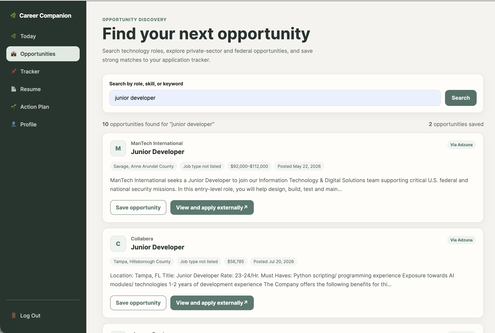
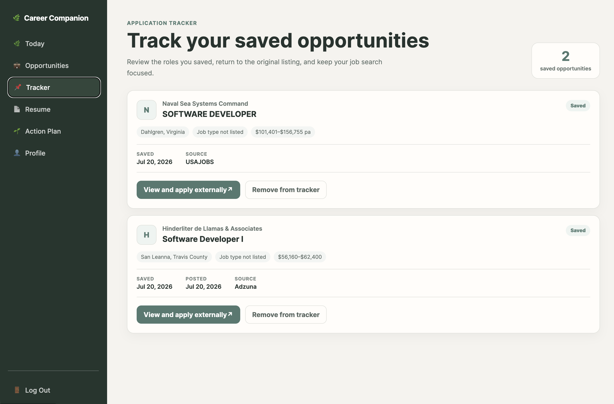
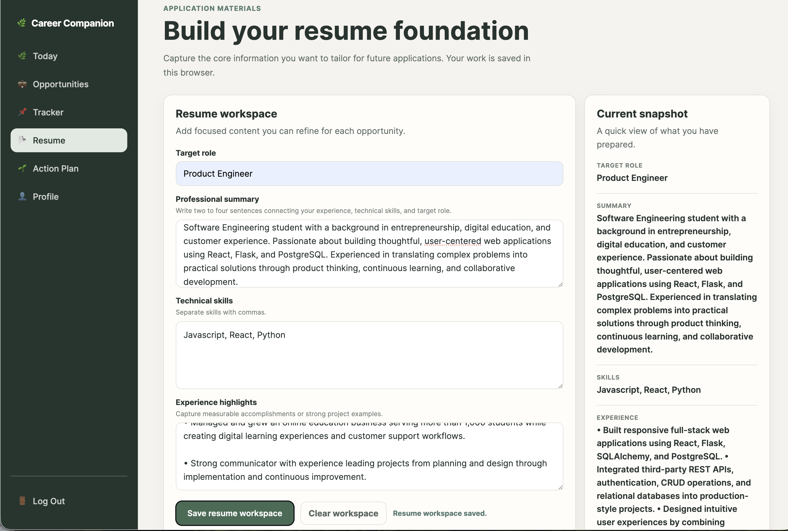
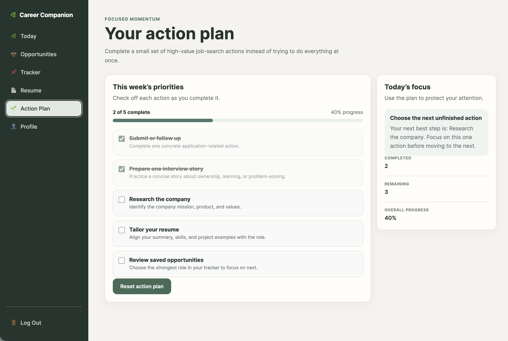
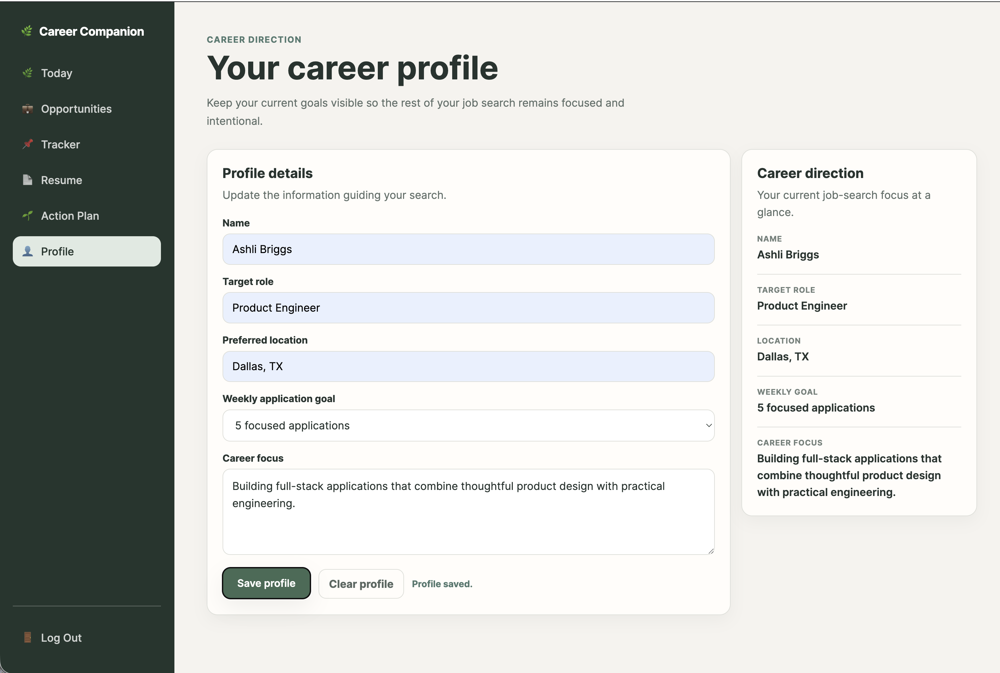
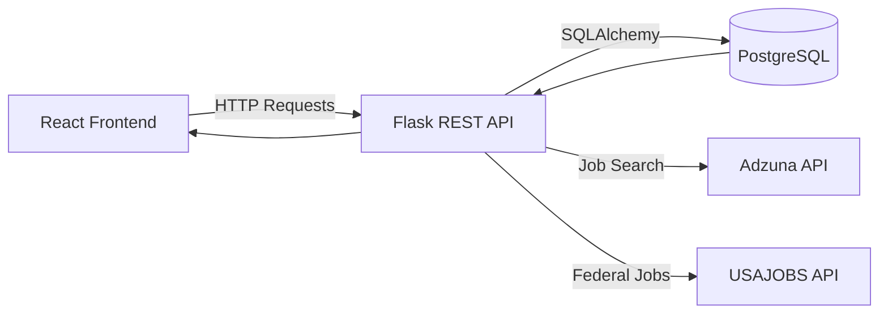
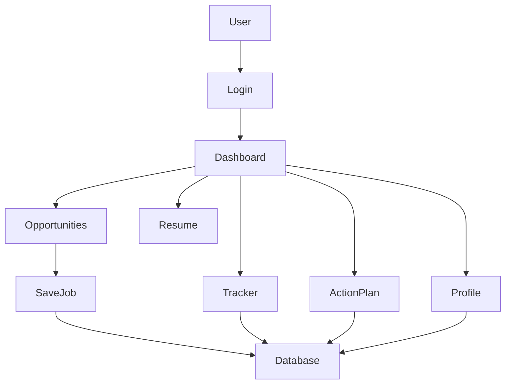
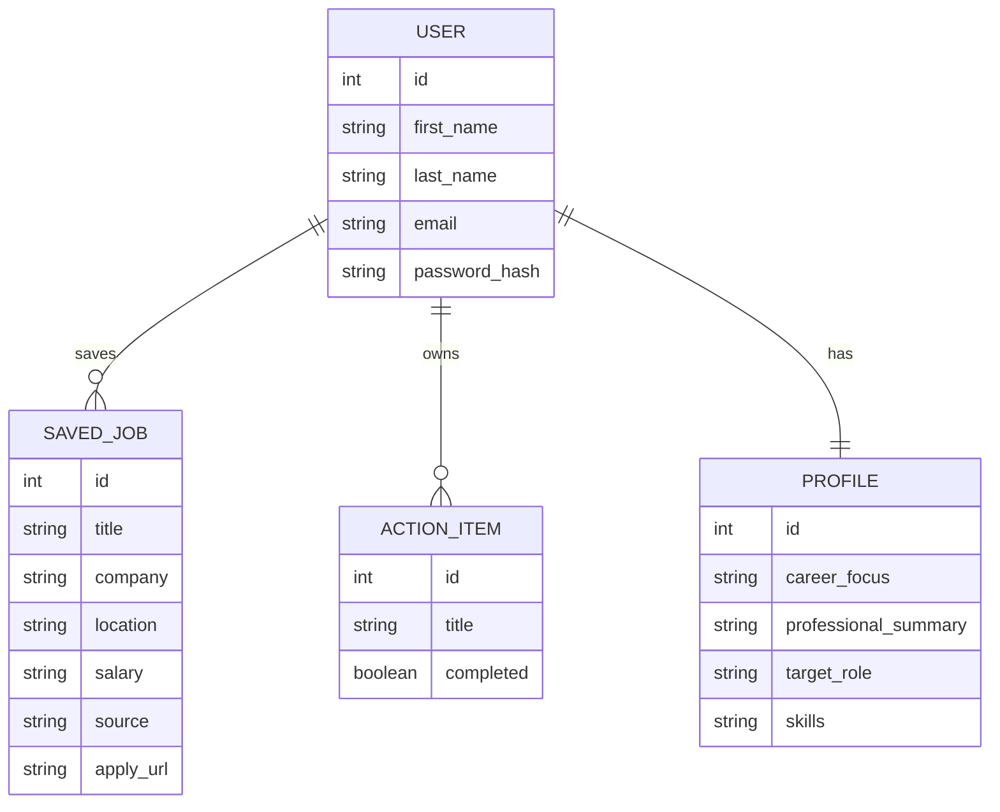

# Career Companion

Career Companion is a full-stack web application designed to help aspiring software engineers stay organized throughout their job search. Instead of juggling spreadsheets, notes, bookmarks, and multiple websites, users can manage their opportunities, track applications, organize resumes, and build consistent career habits from one central workspace.

The project was built as the second phase of my Software Engineering capstone and expands the original React application into a production-style full-stack application with authentication, persistent data, relational databases, REST APIs, and a Flask backend.

Rather than focusing solely on finding jobs, Career Companion focuses on helping users answer a much more important question every day:

> **"What's my next best step?"**

---

## Why I Built Career Companion

Changing careers into software engineering can feel overwhelming.

There are job boards everywhere, dozens of resumes, interview preparation, networking, application tracking, and an endless list of advice about what to do next.

I wanted to build something that reduced that complexity.

Career Companion combines job discovery with personal productivity so users can spend less time organizing their search and more time making meaningful progress.

Instead of becoming another job board, the application acts as a personal career workspace that helps users stay focused on consistent forward movement.

---

# Features

## Authentication

- Secure user registration
- Login and logout
- Password hashing
- Session-based authentication
- Protected backend endpoints
- Personalized user data

---

## Opportunity Search

Search software engineering jobs from multiple public sources including:

- Adzuna
- USAJOBS

Features include:

- Keyword search
- Pagination
- Company information
- Job locations
- Salary information (when available)
- Remote opportunities
- Direct application links
- Save opportunities for later

---

## Saved Opportunities

Users can save interesting positions without leaving the application.

Saved opportunities include:

- Company
- Position
- Location
- Salary
- Source
- Apply URL

---

## Application Tracker

Track progress throughout the application process.

Current statuses include:

- Interested
- Applied
- Interviewing
- Offer
- Rejected

This keeps every opportunity organized in one place instead of relying on spreadsheets or scattered notes.

---

## Action Plan

Career Companion also includes a lightweight productivity system.

Users can create their own action items such as:

- Update resume
- Practice LeetCode
- Send networking message
- Prepare for interview
- Follow up with recruiter

Each action item can be:

- Created
- Updated
- Completed
- Deleted

---

## Resume Workspace

The Resume page provides a dedicated space for organizing resume content.

Although currently populated with sample data, the page establishes the foundation for future resume editing and document generation features.

---

## Career Profile

Users can maintain a personal career profile including:

- Career focus
- Target roles
- Professional summary
- Skills
- Career goals

This creates a central location for information commonly reused across job applications.

---

# Application Screenshots

## Today Dashboard



---

## Opportunity Search



---

## Application Tracker



---

## Resume Workspace



---

## Action Plan



---

## Career Profile



---

# Technology Stack

## Frontend

- React
- React Router
- JavaScript (ES6+)
- CSS3
- Vite

### Frontend Responsibilities

- Client-side routing
- Authentication flow
- Form handling
- API communication
- State management
- Responsive interface
- Loading and error states

---

## Backend

- Python
- Flask
- SQLAlchemy
- Flask-CORS
- PostgreSQL

### Backend Responsibilities

- Authentication
- REST API
- CRUD operations
- Session management
- Database relationships
- External API integration
- Pagination

---

## External APIs

- Adzuna Jobs API
- USAJOBS API

---

## Development Tools

- Git
- GitHub
- VS Code
- Postman
- npm
- pip
- PostgreSQL

---

# System Architecture



---

# High-Level Application Flow




# REST API

The Flask backend exposes a RESTful API that separates the frontend from the application's business logic and database layer. The React application communicates exclusively through these endpoints, allowing the frontend and backend to evolve independently.

---

## Authentication

| Method | Endpoint | Description |
|---------|----------|-------------|
| POST | `/api/auth/signup` | Register a new user |
| POST | `/api/auth/login` | Authenticate an existing user |
| POST | `/api/auth/logout` | End the current session |
| GET | `/api/auth/me` | Return the currently authenticated user |

---

## Opportunities

| Method | Endpoint | Description |
|---------|----------|-------------|
| GET | `/api/opportunities` | Search opportunities from Adzuna and USAJOBS |

### Query Parameters

| Parameter | Description |
|------------|-------------|
| `search` | Search keyword |
| `page` | Current page number |
| `limit` | Results per page |

Example:

```http
GET /api/opportunities?search=frontend&page=1&limit=10
```

---

## Saved Jobs

| Method | Endpoint | Description |
|---------|----------|-------------|
| GET | `/api/saved-jobs` | Retrieve saved jobs |
| POST | `/api/saved-jobs` | Save a new opportunity |
| DELETE | `/api/saved-jobs/<id>` | Remove a saved job |

---

## Action Items

| Method | Endpoint | Description |
|---------|----------|-------------|
| GET | `/api/action-items` | Retrieve action items |
| POST | `/api/action-items` | Create an action item |
| PATCH | `/api/action-items/<id>` | Update an action item |
| DELETE | `/api/action-items/<id>` | Delete an action item |

---

## Profile

| Method | Endpoint | Description |
|---------|----------|-------------|
| GET | `/api/profile` | Retrieve user profile |
| PATCH | `/api/profile` | Update career profile |

---

# Database Design

Career Companion uses PostgreSQL with SQLAlchemy ORM to model the application's persistent data.

The schema is intentionally small, making it easy to extend while demonstrating core relational database concepts.

## Entity Relationship Diagram



---

# Project Structure

```text
career-companion/
│
├── backend/
│   ├── app.py
│   ├── config.py
│   ├── models.py
│   ├── seed.py
│   ├── migrations/
│   └── requirements.txt
│
├── frontend/
│   ├── src/
│   │   ├── components/
│   │   ├── context/
│   │   ├── hooks/
│   │   ├── layouts/
│   │   ├── pages/
│   │   ├── services/
│   │   ├── styles/
│   │   ├── App.jsx
│   │   └── main.jsx
│   │
│   ├── public/
│   └── package.json
│
├── screenshots/
├── README.md
└── .gitignore
```

---

# Engineering Decisions

Every project involves tradeoffs. Rather than adding features simply because they were available, I tried to make decisions that improved the overall product while keeping the application maintainable.

## React + Flask

I chose a separated frontend and backend architecture because it more closely reflects how modern web applications are built. Keeping each layer independent makes it easier to maintain, test, and expand the application over time.

---

## PostgreSQL

Persistent user data was a core requirement for this project. PostgreSQL provided a reliable relational database with strong support for structured data and SQLAlchemy relationships.

---

## SQLAlchemy ORM

Using SQLAlchemy simplified database interactions while allowing the application to model relationships between users, saved jobs, action items, and profiles without writing raw SQL for every operation.

---

## Session-Based Authentication

The application uses secure session-based authentication so users can sign in once and interact with protected resources without repeatedly sending credentials.

---

## Multiple Job APIs

Instead of relying on a single data source, the backend aggregates opportunities from both Adzuna and USAJOBS. This provides broader search results while keeping the frontend implementation consistent through a single API endpoint.

---

## Pagination

Job searches can return hundreds of opportunities.

Implementing backend pagination reduces payload size, improves response times, and creates a smoother user experience while demonstrating a common production pattern used in REST APIs.

---

## Responsive Design

The interface was designed to remain usable across desktop and mobile screen sizes using responsive layouts rather than maintaining separate versions of the application.

---

# Local Installation

## Clone the repository

```bash
git clone https://github.com/ashlibriggs/career-companion.git
```

```bash
cd career-companion
```

---

## Backend

```bash
cd backend
```

Install dependencies:

```bash
pip install -r requirements.txt
```

Run the server:

```bash
python app.py
```

---

## Frontend

```bash
cd frontend
```

Install dependencies:

```bash
npm install
```

Run the development server:

```bash
npm run dev
```

The application will be available at:

```
http://localhost:5173
```


# Future Roadmap

Career Companion was intentionally designed with future expansion in mind. The current application provides a solid full-stack foundation while leaving room for additional features that would further support early-career software engineers.

Potential future enhancements include:

- AI-powered resume feedback
- AI-assisted cover letter generation
- Personalized job recommendations
- Interview preparation workspace
- Goal tracking and career milestones
- Calendar integration for interviews and follow-ups
- Email reminders for application deadlines
- Company research notes
- Resume version management
- Document uploads
- Analytics dashboard for application activity
- OAuth authentication (Google and LinkedIn)
- User profile customization
- Docker deployment
- Automated testing and CI/CD pipeline

---

# What I Learned

Building Career Companion reinforced that successful software development is about more than writing code.

Throughout this project I gained hands-on experience designing and connecting a complete application across multiple layers of the stack. I learned how frontend and backend systems communicate through REST APIs, how relational databases support persistent user data, and how authentication changes the way an application is structured.

One of the most valuable lessons came from debugging. As the project grew, I encountered integration issues that required tracing data from external APIs through the Flask backend and into the React frontend. Working through those problems strengthened my understanding of API design, state management, data transformations, and the importance of maintaining a consistent contract between the client and server.

I also developed a greater appreciation for planning before building. Taking time to think through user workflows, component organization, and backend architecture resulted in cleaner code and made new features easier to add without major refactoring.

Perhaps the biggest takeaway is that software engineering is an iterative process. Every feature, bug fix, and design decision became an opportunity to improve both the application and my own approach to problem solving.

---

# About Me

I'm a Software Engineering student at Southern Methodist University (SMU) and a career changer with a background in entrepreneurship, education, and customer experience.

Before transitioning into software engineering, I built and operated an online education business where I designed digital learning experiences, developed curriculum, and supported more than a thousand students. That experience taught me how to approach problems from the user's perspective, balance technical decisions with business goals, and build products that solve real problems.

As I continue growing as a software engineer, I'm especially interested in full-stack development, developer tools, AI-powered products, and product-minded engineering. I enjoy building applications that combine thoughtful user experiences with practical technical solutions.

This project represents an important milestone in that journey and reflects the skills I've developed in React, Flask, PostgreSQL, REST APIs, relational databases, authentication, and full-stack application architecture.

---

## Connect With Me

- **GitHub:** [github.com/ashlibriggs](https://github.com/ashlibriggs)
- **LinkedIn:** [linkedin.com/in/ashli-briggs](https://www.linkedin.com/in/ashli-briggs/)

---

# Acknowledgements

This project was developed as part of the Southern Methodist University (SMU) Software Engineering Bootcamp.

Public job opportunity data is provided by:

- Adzuna Jobs API
- USAJOBS API

Additional open-source tools and libraries used throughout the project include:

- React
- React Router
- Flask
- SQLAlchemy
- PostgreSQL
- Vite

I appreciate the open-source community for building and maintaining the tools that make projects like this possible.

---

# License

This project is licensed under the MIT License.

See the LICENSE file for additional details.
