# Career Companion AI

Career Companion AI is a full stack career management platform designed for bootcamp graduates, career changers, and entry level technology professionals navigating today's competitive job market.

Rather than functioning as another job board, Career Companion AI helps users organize every stage of their job search in one place while providing intelligent guidance about what to work on next.

The application combines traditional software engineering principles with responsible AI implementation. Core product decisions are made through transparent business rules built into the application, while Google's Gemini API is used only to communicate recommendations in a more natural, encouraging, and conversational way.

This project was built as the final capstone for the SMU Software Engineering Bootcamp and represents the evolution of the Career Companion platform across three milestone projects.

---

## The Problem

Searching for a first technology role can quickly become overwhelming.

Job seekers often struggle to manage:

- Job applications
- Resume revisions
- Career planning
- Daily priorities
- Progress tracking
- Interview preparation

Most tools solve only one piece of the process.

Career Companion AI brings everything together into one guided workflow that keeps users focused on their next manageable step.

---

## The Solution

Career Companion AI combines:

- Secure user authentication
- Personalized career profiles
- Resume workspace
- Opportunity search
- Saved job tracker
- Action plan management
- AI assisted daily recommendations

Instead of asking users to decide what to do next, the application continuously recommends one clear next step based on their current progress.

---

# Key Features

## Secure Authentication

- User registration
- Login
- Logout
- Protected routes
- Session based authentication
- User owned resources

---

## Career Profile

Store career information including:

- Target role
- Preferred location
- Weekly application goals
- Career focus

All information is securely stored in PostgreSQL.

---

## Resume Workspace

Create and maintain a working resume including:

- Professional summary
- Skills
- Experience highlights
- Target position

Resume information persists across sessions.

---

## Opportunity Search

Search live technology opportunities using multiple external job providers.

Results are normalized into a consistent interface regardless of provider.

Users can:

- Search jobs
- View descriptions
- Save opportunities
- Return later

---

## Application Tracker

Track opportunities through different stages.

Users can:

- Save jobs
- Monitor progress
- Organize active opportunities
- Focus on current priorities

---

## Action Plan

Create personalized career tasks with full CRUD functionality.

Users can:

- Create actions
- Edit actions
- Delete actions
- Mark actions complete
- Prioritize tasks

---

## Career Companion AI

The application's signature feature.

Career Companion AI evaluates a user's:

- Career Profile
- Resume Workspace
- Saved Opportunities
- Action Plan

It then recommends one clear next step to help the user continue making progress.

Unlike many AI powered applications, the recommendation itself is **not** generated by AI.

Career Companion AI first applies transparent business rules to determine the best recommendation. Google's Gemini API is then used only to communicate those recommendations in a more natural, encouraging, and conversational way.

This creates recommendations that are:

- Explainable
- Consistent
- Product driven
- Human centered

---

# Screenshots

## Today Dashboard

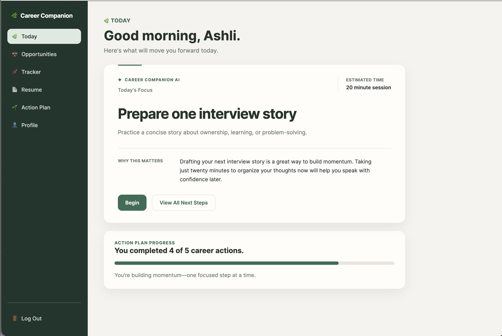

---

## Guided Session

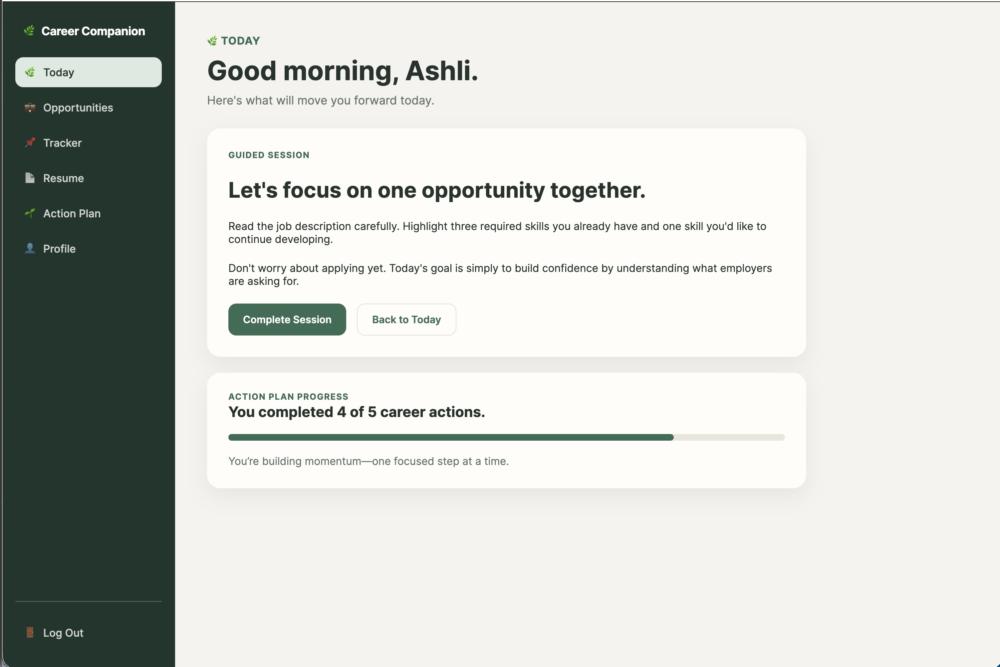

---

## Session Complete

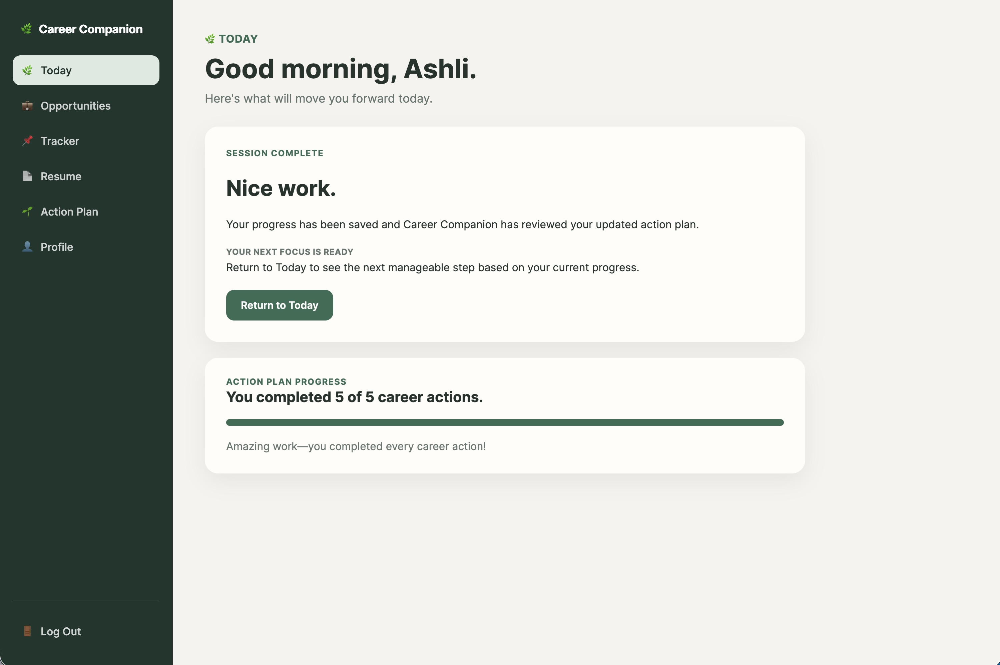

---

## Opportunities Search

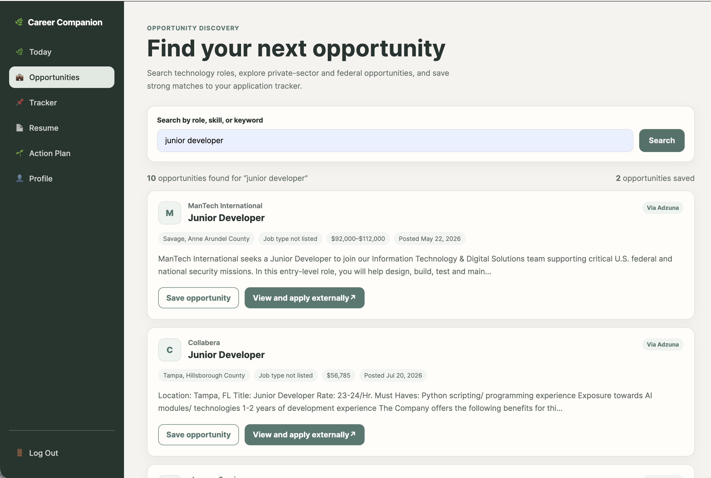

---

## Application Tracker

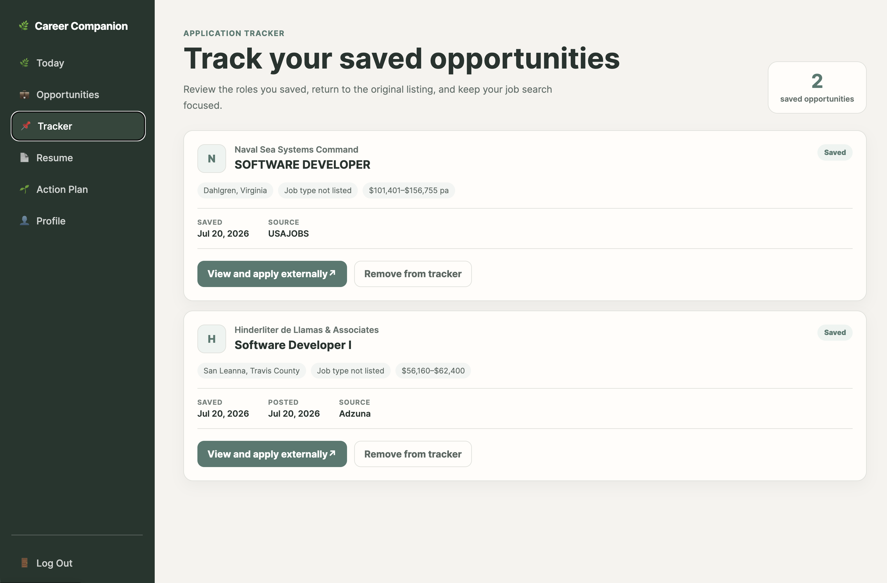

---

## Resume Workspace

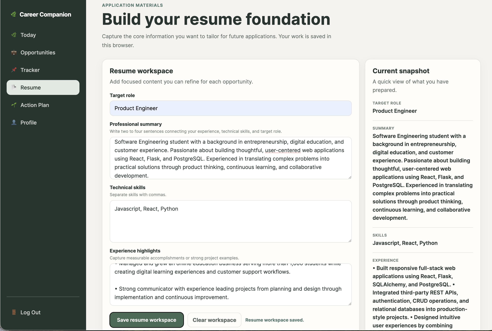

---

## Career Profile

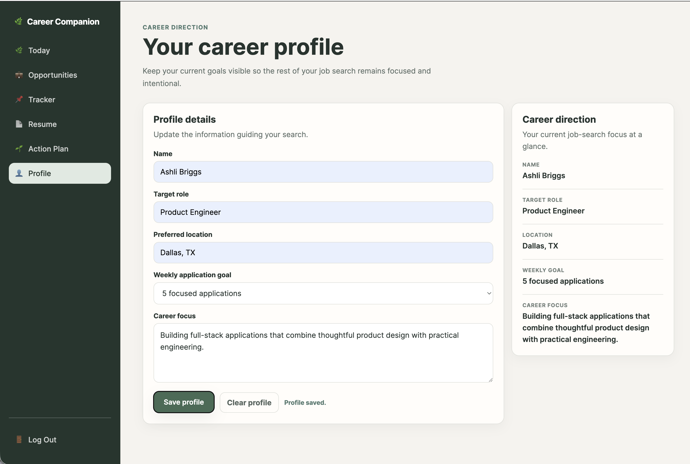

---

## Action Plan

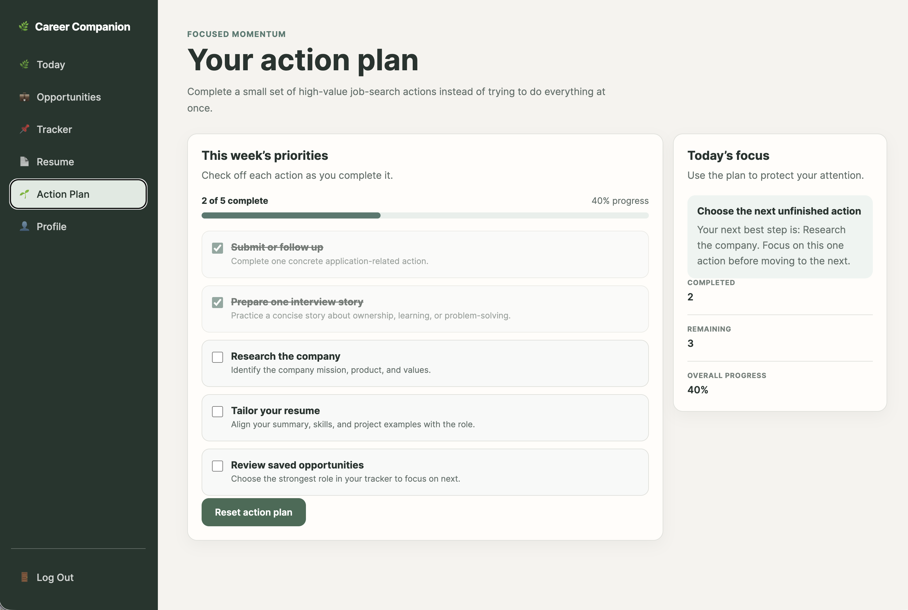

---

# Technology Stack

## Frontend

- React
- React Router
- JavaScript
- CSS
- Vite

## Backend

- Flask
- SQLAlchemy
- Flask Sessions
- Flask Migrate

## Database

- PostgreSQL

## AI

- Google Gemini API

## External APIs

- Adzuna
- USAJobs

## Development

- Git
- GitHub
- VS Code


# System Architecture

Career Companion AI follows a modern full stack architecture with a clear separation of concerns between the frontend, backend, database, recommendation engine, and AI enhancement layer.

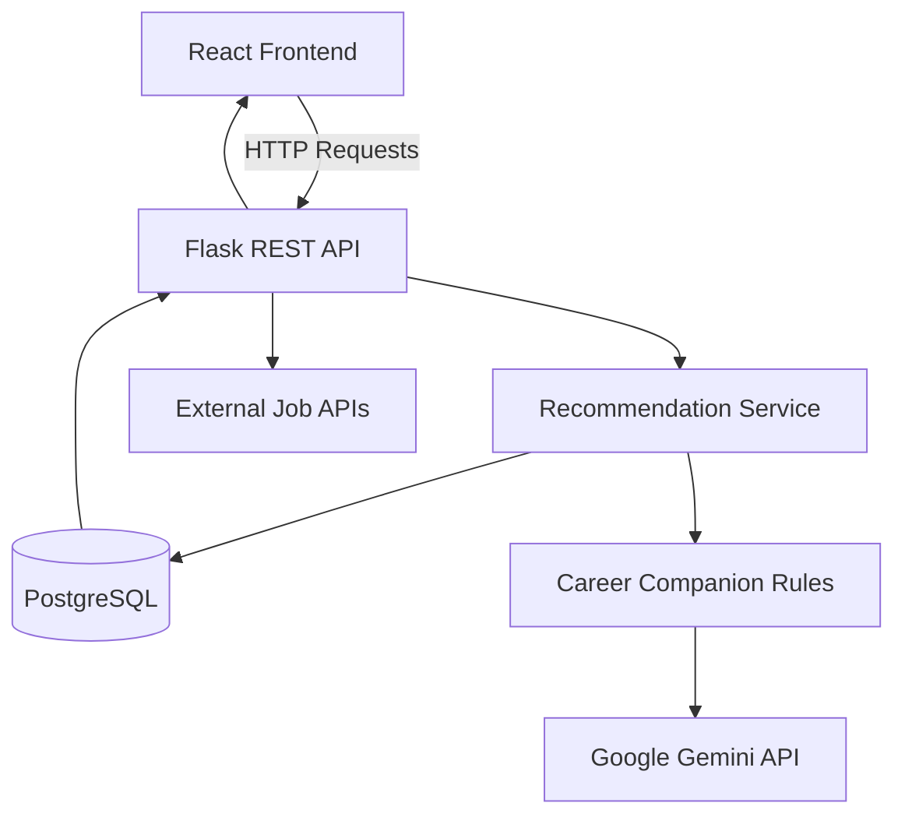
```mermaid
flowchart TD

A[React Frontend]

B[Flask REST API]

C[Recommendation Service]

D[(PostgreSQL)]

E[Career Companion Rules]

F[Google Gemini API]

G[External Job APIs]

A -->|HTTP Requests| B

B --> C

C --> D

C --> E

E --> F

B --> G

D --> B

B --> A
```

---

# AI Recommendation Architecture

One of the primary design goals for Career Companion AI was building an AI experience that remains transparent, predictable, and user centered.

Rather than allowing a language model to determine what a user should do next, Career Companion AI first evaluates the user's current progress using deterministic product rules.

Those rules analyze:

- Career Profile
- Resume Workspace
- Saved Opportunities
- Action Plan

Once the application determines the user's Next Best Step, Google's Gemini API transforms that recommendation into supportive coaching language while preserving the original product decision.

```text
Career Profile
        │
Resume Workspace
        │
Saved Opportunities
        │
Action Plan
        │
Recommendation Engine
        │
Transparent Product Rules
        │
Gemini Language Enhancement
        │
Today's Focus
```

This architecture keeps recommendations:

- Explainable
- Predictable
- Consistent
- Under application control

while still providing a natural conversational experience.

---

# High Level Application Flow

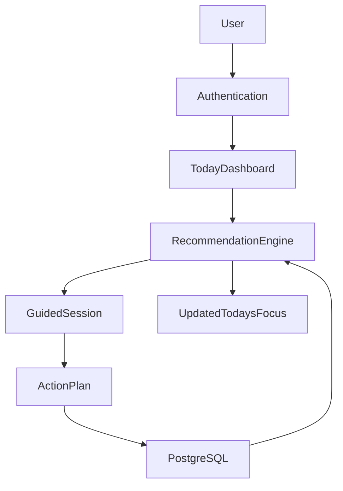
```mermaid
flowchart TD

User

User --> Authentication

Authentication --> TodayDashboard

TodayDashboard --> RecommendationEngine

RecommendationEngine --> GuidedSession

GuidedSession --> ActionPlan

ActionPlan --> PostgreSQL

PostgreSQL --> RecommendationEngine

RecommendationEngine --> UpdatedTodaysFocus
```

---

# REST API

Career Companion AI exposes a RESTful backend that separates the React interface from application logic and persistent storage.

---

## Authentication

| Method | Endpoint | Description |
|---------|----------|-------------|
| POST | `/api/auth/signup` | Register a new user |
| POST | `/api/auth/login` | Authenticate a user |
| GET | `/api/auth/me` | Return the authenticated user |
| DELETE | `/api/auth/logout` | End the current session |

---

## AI Recommendation

| Method | Endpoint | Description |
|---------|----------|-------------|
| GET | `/api/recommendation` | Returns the user's personalized Next Best Step |

---

## Opportunities

| Method | Endpoint | Description |
|---------|----------|-------------|
| GET | `/api/opportunities` | Search opportunities from multiple public APIs |

---

## Saved Jobs

| Method | Endpoint | Description |
|---------|----------|-------------|
| GET | `/api/saved-jobs` | Retrieve saved opportunities |
| POST | `/api/saved-jobs` | Save a new opportunity |
| DELETE | `/api/saved-jobs/<id>` | Remove a saved opportunity |

---

## Action Items

| Method | Endpoint | Description |
|---------|----------|-------------|
| GET | `/api/action-items` | Retrieve action items |
| POST | `/api/action-items` | Create action item |
| PATCH | `/api/action-items/<id>` | Update action item |
| DELETE | `/api/action-items/<id>` | Delete action item |

---

## Career Profile

| Method | Endpoint | Description |
|---------|----------|-------------|
| GET | `/api/profile` | Retrieve career profile |
| PATCH | `/api/profile` | Update career profile |

---

## Resume Workspace

| Method | Endpoint | Description |
|---------|----------|-------------|
| GET | `/api/resume` | Retrieve resume workspace |
| PATCH | `/api/resume` | Update resume workspace |

---

# Database Design

Career Companion AI stores user data in PostgreSQL using SQLAlchemy ORM.

Each authenticated user owns their own:

- Career Profile
- Resume Workspace
- Saved Opportunities
- Action Plan

This creates complete separation between users while allowing Career Companion AI to personalize recommendations.

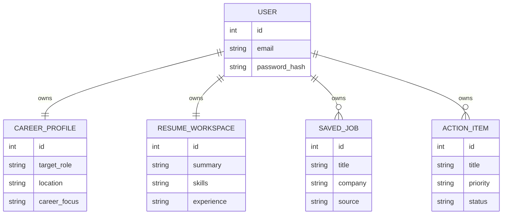
```mermaid
erDiagram

USER ||--|| CAREER_PROFILE : owns

USER ||--|| RESUME_WORKSPACE : owns

USER ||--o{ SAVED_JOB : owns

USER ||--o{ ACTION_ITEM : owns

USER {

int id

string email

string password_hash

}

CAREER_PROFILE {

int id

string target_role

string location

string career_focus

}

RESUME_WORKSPACE {

int id

string summary

string skills

string experience

}

ACTION_ITEM {

int id

string title

string priority

string status

}

SAVED_JOB {

int id

string title

string company

string source

}
```

---

# Engineering Decisions

Every feature within Career Companion AI was designed with one goal:

Help users consistently identify and complete the next meaningful step in their job search.

---

## Transparent AI Decision Making

One of the most important engineering decisions in this project was separating product intelligence from language generation.

Rather than allowing a language model to make product decisions, I designed a recommendation engine that uses deterministic business rules to choose the user's next best step before using Gemini to communicate those recommendations in a more natural, encouraging, and conversational way.

This architecture creates recommendations that remain explainable, predictable, and aligned with the product's goals while still providing users with a supportive AI experience.

---

## React + Flask

Separating the frontend and backend creates a maintainable architecture where each layer has a clear responsibility while communicating through REST APIs.

---

## PostgreSQL

Persistent storage allows users to build progress over time rather than restarting every session.

---

## SQLAlchemy

Using SQLAlchemy simplified relational data modeling while keeping application code organized and readable.

---

## Session Authentication

Session based authentication keeps user data secure while providing a seamless experience throughout the application.

---

## Recommendation Refresh

Completing a guided session immediately updates PostgreSQL, refreshes the user's progress, and generates a new personalized recommendation without requiring a manual page refresh.

This creates an experience where Career Companion AI adapts alongside the user's progress.

---

# Local Installation

## Clone Repository

```bash
git clone https://github.com/ashlibriggs/career-companion.git
```

```bash
cd career-companion
```

## Backend

```bash
cd backend
pip install -r requirements.txt
python app.py
```

## Frontend

```bash
cd frontend
npm install
npm run dev
```

Open:

```
http://localhost:5173
```


# Future Roadmap

Career Companion AI was intentionally designed as a strong MVP while leaving room for future expansion. The current application establishes a solid full stack foundation that can continue evolving into a comprehensive AI powered career management platform.

Future enhancements include:

- AI interview preparation with personalized coaching
- Resume scoring against saved job descriptions
- AI assisted networking message generation
- Weekly career progress summaries
- Personalized learning recommendations
- Company research workspace
- Calendar integration for interviews and application deadlines
- Resume version management
- Cover letter workspace
- Application analytics dashboard
- Google and LinkedIn OAuth authentication
- Docker deployment
- Automated testing and CI/CD pipeline

---

# What I Learned

Building Career Companion AI reinforced that successful software engineering is about far more than writing code.

Throughout this project, I gained hands on experience designing, connecting, and refining a complete application across every layer of the stack. I strengthened my understanding of React, Flask, PostgreSQL, REST APIs, authentication, relational database design, and the communication between frontend and backend systems.

As the application evolved, I also learned that the best technical solution is not always the most complex one. Some of the most valuable improvements came from simplifying user workflows, improving application state management, and designing software that feels intuitive rather than overwhelming.

One of the most meaningful lessons from this project came from integrating artificial intelligence responsibly into a real application.

Rather than allowing a language model to make product decisions, I designed a recommendation engine that uses deterministic business rules to choose each user's next best step before using Google's Gemini API to communicate those recommendations in a more natural, encouraging, and conversational way.

That experience fundamentally changed how I think about AI.

I no longer see AI as something that replaces engineering or product thinking. Instead, I see it as a powerful assistant that can improve communication, reduce friction, and enhance the user experience while keeping the application's business logic transparent, predictable, and under the developer's control.

Perhaps the biggest lesson from Career Companion AI is that thoughtful software design begins long before writing code. Every architectural decision, database relationship, user workflow, and AI integration should ultimately serve the people using the product.

That mindset is something I will continue carrying into every future project.

---

# About Me

I'm a Software Engineering student at Southern Methodist University (SMU) and a career changer with a background in entrepreneurship, digital education, and customer experience.

Before transitioning into software engineering, I founded and operated an online education business where I designed digital learning experiences, developed curriculum, and supported more than one thousand students. That experience strengthened my ability to solve problems from the user's perspective while balancing technical decisions with business goals.

Today I'm especially interested in full stack software engineering, AI powered products, developer tools, and product minded engineering.

Career Companion AI represents the culmination of my software engineering capstone and reflects my growth in building modern full stack applications using React, Flask, PostgreSQL, REST APIs, authentication, relational databases, and responsible AI integration.

---

## Connect With Me

**GitHub**

https://github.com/ashlibriggs

**LinkedIn**

https://www.linkedin.com/in/ashli-briggs/

---

# Acknowledgements

Career Companion AI was developed as the final capstone project for the Southern Methodist University (SMU) Software Engineering Bootcamp.

This project would not have been possible without the excellent open source community whose libraries, frameworks, and tools continue to make software development more accessible.

Technologies and services used throughout the project include:

- React
- React Router
- Flask
- SQLAlchemy
- PostgreSQL
- Vite
- Google Gemini API
- Adzuna Jobs API
- USAJOBS API

I am grateful to the instructors, classmates, and open source contributors whose work and feedback supported my learning throughout this journey.

---

# License

This project is licensed under the MIT License.

See the LICENSE file for additional details.